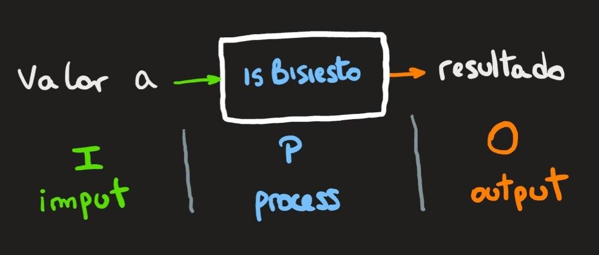

## Ornella Olivastri - Legajo 1674201 - Curso K1051 - Año 2020 
---
## TP 03 - isBisiesto
---
### Etapa 1: Análisis del problema
#### Enunciado
 Dado un año, determinar si es bisiesto.

#### Restricciones
- El nombre de la funcion debe ser isBisiesto
- Aplicar operadores booleanos
- No aplicar el operador condicional
- No aplicar if ni switch

#### Hipotesis de trabajo
1. Los años son numeros pertenecientes al conjunto de naturales
2. Para que un año sea bisiesto debe cumplir ciertas condiciones, las cuales dependerán del calendario según el cual se haga la evaluacion (Sumerio, Juliano, Gregoriano, etc.)
2. El calendario utilizado en la actualidad es el Gregoriano, puesto en practica en el año 1582. Las condiciones para que un año sea bisiesto según este calendario son:
    a. Ser un numero natural
    b. Ser un natural mayor a 1582
    Existirán dos casos:
        c. Ademas de a y b, debe ser un numero divisible por 4 y no divisible por 100
        d. Ademas de a y b, debe ser un numero divisible por 4, por 100 y por 400 simultáneamente
3. La determinación de que un año posee la caracteristica de ser bisiesto - o no - se puede indicar con un verdadero o falso.

---
### Etapa 2: Diseño de la solucion
Para comenzar a diseñar hay que tener en cuenta el objetivo del programa: determinar si un año es bisiesto. Para ello definiré una función llamada isBisiesto que evalúe las condiciones mencionadas sobre un numero natural correspondiente a un año.

#### Modelo IPO: 

#### Lógica de la funcion isBisiesto:
1. La funcion recibirá una variable de tipo entero
2. Luego evaluará las condiciones de los años bisiestos 
3. Finalmente devolverá un resultado de tipo bool correspondiente con las condiciones:

resultado = (a < 1582 ∧ divisible por 4) ∧ [no divisible por 100 ∨ (divisible por 100 ∧ divisible por 400)]

#### Léxico: 
a ϵ N -> resultado ϵ B . (N: conjunto de naturales | B: conjunto de booleanos)

#### Definición matemática de la función:

#### Definición para C++ de la función:

