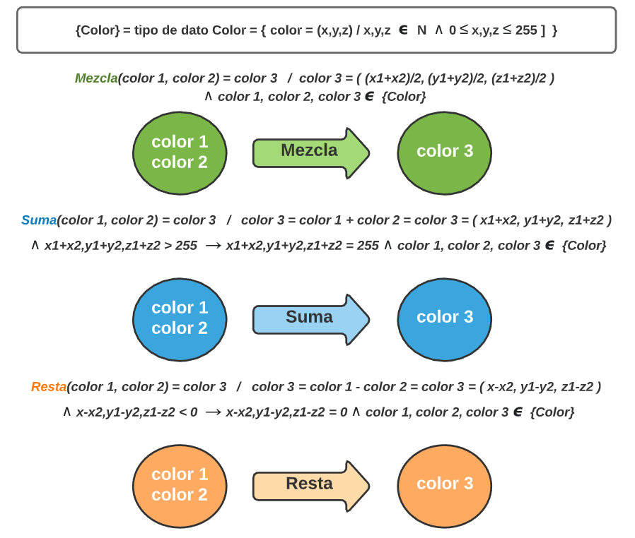

## Ornella Olivastri - Legajo 1674201 - Curso K1051 - Año 2020 
---
## TP 4 - Tipo de dato Color
---
### Etapa 1: Análisis del problema
#### Enunciado
- Crear tipo basado en el modelo RGB con 3 canales de 8 bits
- Cada color tiene su intensidad con rango [0,255]
- Colores a definir: rojo, azul, verde, cyan, magenta, amarillo, negro y blanco
- Desarrollar una funcion que mezcle colores, produciendo uno nuevo al cual corresponderá el promedio de intensidad de cada componente

#### Restricciones
- No definir getters y setters especiales para las operaciones de proyeccion. 
- Usar el tipo uint8_t de cstdint (o en su defecto usar unsigned char) 
- Los colores primarios, secundarios, negro y blanco deben implementarse como 8 variables declaradas fuera del main y de toda funcion con el calificador const para que no puedan modificarse.
- Implementar la operación IsIgual que retorne true si un color es igual a otro, y sino false. 

#### Hipotesis de trabajo
1. Los tipos de datos estan definidos por dos cosas principales: su conjunto de valores y las operaciones asociadas a ese conjunto de valores.
2. d

#### Modelo IPO (con su léxico): 

---
### Etapa 2: Diseño de la solucion
Para comenzar a diseñar hay que tener en cuenta el objetivo del programa: crear e implementar el tipo de dato Color, el cual debe estar basado en el modelo RGB con 3 canales de 8 bits, que representa la intensidad de cada componente con el rango [0,255]. Para ello .....

