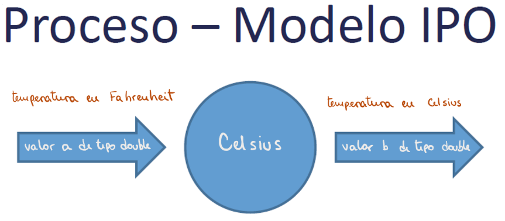

## Ornella Olivastri - Legajo 1674201 - Curso K1051 - Año 2020 
---
## TP 04 - Celsius
---
### Etapa 1: Análisis del problema
#### Enunciado
Desarrollar  una  función  que,  dada  una  magnitud  en  Farehnheit,  calcule la equivalente en Celsius.

#### Restricciones
- Las pruebas deben realizarse con assert
- Los prototipos deben ser:

    double Celsius(double);bool 
    
    double AreNear(double, double, double tolerancia = 0.001);

#### Hipotesis de trabajo
1. Los grados Fahrenheit pueden tener decimales, con lo cual deberé trabajar con datos tipo double
2. Con el fin de implementar la funcion assert para realizar las pruebas deberé comparar datos de tipo double, por lo tanto deberé diseñar una funcion que compare estos tipos de dato con un rango de tolerancia determinado, el cual será 0.001

#### Modelo IPO: 

---
### Etapa 2: Diseño de la solucion
Para comenzar a diseñar hay que tener en cuenta el objetivo del programa: dada una temperatura en grados Farehnheit, calcular su equivalente en grados Celsius. Para ello diseñaré la **función Celsius** que será de tipo double. 
Por otro lado, para usar la función assert voy a tener que diseñar una función que me permita comparar datos de tipo double. Comparará los grados que devuelva la función Celsius con el valor de prueba. Esta será la **función AreNear** que será de tipo bool.

#### Lógica de la función Celsius:
1. Tomar un valor de temperatura (tipo double) en grados Farehnheit.
2. Restarle 32 grados Farehnheit (tipo double) y multiplicar el resultado por la fracción 5/9  (tipo double).
3. Devolver el equivalente de la temperatura inicial, en grados Celsius (tipo double).

#### Lógica de la función AreNear:
1. Determinar un valor que corresponda al margen de error permitido entre valores de tipo double. Este valor a su vez será de tipo double y se llamará *tolerancia*. En mi caso, 0.001 .
2. Tomar un dos valores de tipo double llamados a y b.
3. Evaluar si a es mayor a b. De ser cierto, entonces comprobar si la resta: a - b es menor o igual que el valor de la tolerancia.
4. Devolver el equivalente de la temperatura inicial, en grados Celsius.

#### Léxico de la función Celsius: 
*Celsius(a) ϵ {double} -> b ϵ {double}* . ( {double}: conjunto de los valores de tipo double)

#### Léxico de la función AreNear:
*AreNear(a,b,0.001) ϵ {double} -> b ϵ {bool}* . 

 {double}: conjunto de los valores de tipo double | {bool}: conjunto de los valores de tipo bool

#### Definición matemática de la función Celsius:

#### Definición matemática de la función AreNear

#### Definición para C++ de la función Celsius:

#### Definición para C++ de la función AreNear:

#### Valores de prueba:

